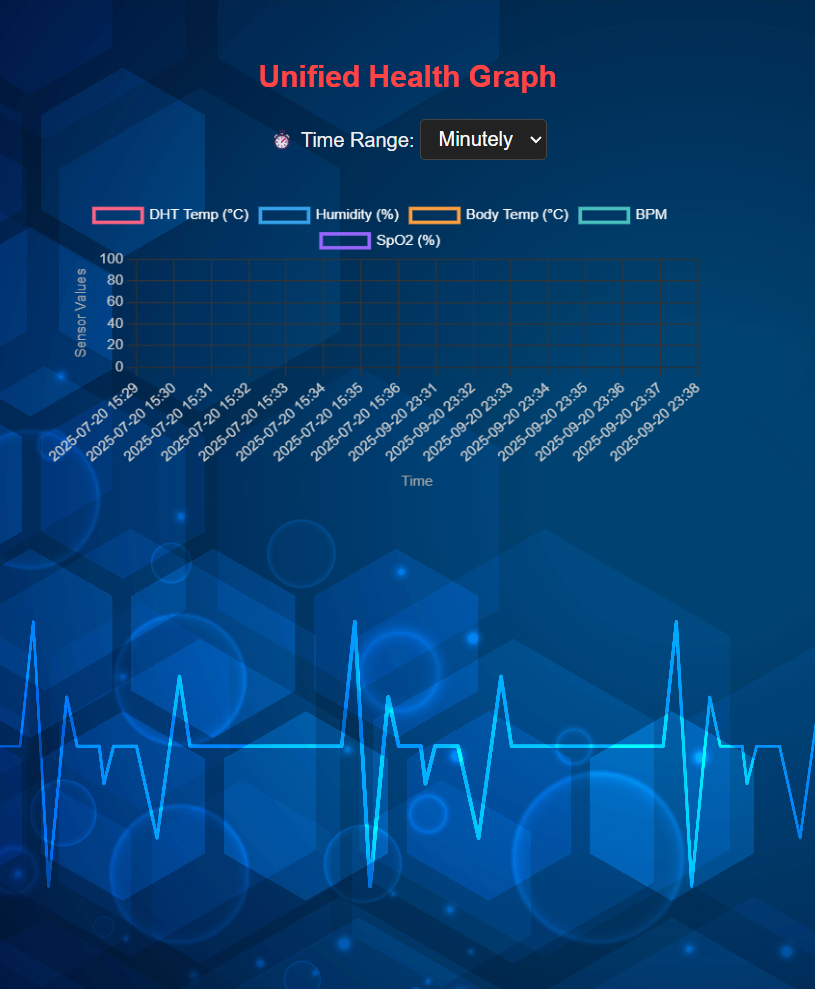

# CareConnect - IoT-Based Patient Health Monitoring System


CareConnect is a comprehensive IoT-based health monitoring system that tracks vital signs including body temperature, heart rate, blood oxygen levels (SpO2), room temperature, and humidity in real-time. The system combines ESP32 microcontroller with multiple sensors and provides both local web interface and database-driven dashboard for data visualization and analysis.

## 🌟 Features

- **Real-time Health Monitoring**: Continuous monitoring of vital signs
- **Multi-sensor Integration**: DHT11, DS18B20, and MAX30100 sensors
- **Dual Interface**: 
  - Local ESP32 web server for direct access  
  - PHP/MySQL dashboard for data analysis
- **Data Visualization**: Interactive charts with Chart.js
- **Multiple Time Ranges**: View data by minute, hour, day, week, or month
- **Auto-refresh**: Real-time data updates every 60 seconds
- **Responsive Design**: Works on desktop and mobile devices
- **WiFi Connectivity**: Wireless data transmission and remote access

## 📊 System Architecture

```
[Sensors] → [ESP32] → [WiFi] → [Database] → [Web Dashboard]
    ↓
[Local Web Interface]
```

### Hardware Components

- **ESP32 Development Board**: Main microcontroller
- **DHT11**: Temperature and humidity sensor
- **DS18B20**: Waterproof body temperature sensor  
- **MAX30100**: Heart rate and SpO2 sensor
- **I2C Interface**: For sensor communication

### Software Stack

- **Arduino IDE**: For ESP32 programming
- **PHP**: Backend API for data processing
- **MySQL**: Database for data storage
- **JavaScript**: Frontend interactivity
- **Chart.js**: Data visualization library
- **HTML/CSS**: User interface

## 🔧 Hardware Setup

### Pin Configuration

```cpp
DHT11 Sensor:
- VCC → 3.3V
- GND → GND  
- Data → GPIO 18

DS18B20 Sensor:
- VCC → 3.3V
- GND → GND
- Data → GPIO 4

MAX30100 Sensor:
- VCC → 3.3V
- GND → GND
- SDA → GPIO 21
- SCL → GPIO 22
```

### Circuit Diagram
*(Include your circuit diagram here if available)*

## 🚀 Local Setup

### Prerequisites

- Arduino IDE (1.8.19 or later)
- XAMPP/WAMP/LAMP server
- MySQL database
- ESP32 board package for Arduino IDE

### Arduino Libraries Required

Install these libraries through Arduino IDE Library Manager:

```
- WiFi (ESP32)
- WebServer (ESP32)
- DHT sensor library
- OneWire
- DallasTemperature  
- MAX30100lib PulseOximeter
```

### Database Setup

1. **Start XAMPP/WAMP** and ensure Apache and MySQL are running

2. **Create Database**:
   ```sql
   CREATE DATABASE careconncet;
   ```

3. **Create Table**:
   ```sql
   USE careconncet;
   
   CREATE TABLE sensor_data (
       id INT AUTO_INCREMENT PRIMARY KEY,
       dhtTemp FLOAT,
       humidity FLOAT,
       bodyTemp FLOAT,
       bpm FLOAT,
       spo2 FLOAT,
       timestamp TIMESTAMP DEFAULT CURRENT_TIMESTAMP
   );
   ```

### ESP32 Configuration

1. **Open Arduino IDE** and load `sketch_jul4a/sketch_jul4a.ino`

2. **Update WiFi Credentials**:
   ```cpp
   const char* ssid = "Your_WiFi_SSID";
   const char* password = "Your_WiFi_Password";
   ```

3. **Install ESP32 Board Package**:
   - Go to File → Preferences
   - Add to Additional Board Manager URLs:
     ```
     https://dl.espressif.com/dl/package_esp32_index.json,https://raw.githubusercontent.com/espressif/arduino-esp32/gh-pages/package_esp32_index.json
     ```
   - Tools → Board → Board Manager → Search "ESP32" → Install

4. **Select Board**: Tools → Board → ESP32 Dev Module

5. **Upload Code** to ESP32

### Web Application Setup

1. **Copy Project Files**:
   ```bash
   # Copy all files to your web server directory
   # For XAMPP: C:\xampp\htdocs\careConnect\
   # For WAMP: C:\wamp64\www\careConnect\
   ```

2. **Update Database Connection** in `fetch_data.php`:
   ```php
   $host = "localhost";
   $dbname = "careconncet";
   $username = "root";
   $password = ""; // Your MySQL password
   ```

3. **Update API URL** in `assets/js/script.js`:
   ```javascript
   const response = await fetch(`http://localhost/careConnect/fetch_data.php?filter=${filter}`);
   ```

## 🌐 Online Deployment

### Deploy on Render

1. **Prepare for Deployment**:
   - Create a GitHub repository with your project
   - Add a `composer.json` file for PHP:
     ```json
     {
         "require": {
             "php": "^7.4.0"
         }
     }
     ```

2. **Database Setup on Render**:
   - Create a PostgreSQL database service on Render
   - Update connection settings in `fetch_data.php`

3. **Deploy Web Service**:
   - Connect your GitHub repository
   - Set build command: `composer install`
   - Set start command: `php -S 0.0.0.0:$PORT -t .`

4. **Environment Variables**:
   ```
   DB_HOST=your_db_host
   DB_NAME=your_db_name  
   DB_USER=your_db_user
   DB_PASS=your_db_password
   ```

### Deploy on Heroku

1. **Install Heroku CLI**

2. **Create Heroku App**:
   ```bash
   heroku create your-app-name
   ```

3. **Add Database**:
   ```bash
   heroku addons:create heroku-postgresql:hobby-dev
   ```

4. **Deploy**:
   ```bash
   git add .
   git commit -m "Deploy CareConnect"
   git push heroku main
   ```

### Deploy on Netlify (Frontend Only)

1. **Build Static Version**: Create a static version without PHP
2. **Connect Repository**: Link your GitHub repository  
3. **Configure Build**: Set publish directory to root
4. **Deploy**: Automatic deployment on git push

## 📱 Usage

### Local Access

1. **ESP32 Interface**: 
   - Find ESP32 IP address from Serial Monitor
   - Access: `http://ESP32_IP_ADDRESS`
   - View real-time sensor readings and charts

2. **Web Dashboard**:
   - Access: `http://localhost/careConnect/`
   - Select time range (minutely, hourly, daily, weekly, monthly)
   - View historical data trends

### Features Overview

- **Real-time Monitoring**: Live sensor data updates
- **Historical Analysis**: View trends over different time periods  
- **Multi-parameter Display**: Temperature, humidity, heart rate, SpO2
- **Responsive Charts**: Interactive data visualization
- **Auto-refresh**: Page updates every 60 seconds

## 📸 Screenshots

### Web Dashboard


### ESP32 Local Interface
*(The ESP32 provides a local web interface accessible via its IP address)*

## 🔧 Troubleshooting

### Common Issues

1. **ESP32 Connection Issues**:
   - Check WiFi credentials
   - Verify network connectivity
   - Monitor Serial output for debugging

2. **Sensor Reading Issues**:
   - Verify wiring connections
   - Check power supply (3.3V)
   - Ensure proper I2C connections for MAX30100

3. **Database Connection Issues**:
   - Verify MySQL service is running
   - Check database credentials
   - Ensure database and table exist

4. **Chart Not Loading**:
   - Check browser console for errors
   - Verify Chart.js CDN link
   - Ensure proper API response format

### Debug Commands

```bash
# Check PHP errors
tail -f /var/log/apache2/error.log

# Test database connection
mysql -u root -p careconncet

# Verify API response
curl http://localhost/careConnect/fetch_data.php?filter=hourly
```

## 🔒 Security Considerations

- Change default database passwords
- Implement input validation and sanitization
- Use HTTPS for production deployment
- Secure WiFi credentials in ESP32 code
- Implement proper authentication for sensitive data

## 🚀 Future Enhancements

- [ ] Mobile app development
- [ ] Alert system for abnormal readings
- [ ] Multiple patient support
- [ ] Data export functionality
- [ ] Cloud integration (AWS IoT, Google Cloud)
- [ ] Machine learning for health predictions
- [ ] SMS/Email notifications
- [ ] User authentication system

## 🤝 Contributing

1. Fork the repository
2. Create a feature branch (`git checkout -b feature/new-feature`)
3. Commit changes (`git commit -am 'Add new feature'`)
4. Push to branch (`git push origin feature/new-feature`)
5. Create Pull Request

## 📄 License

This project is licensed under the MIT License - see the [LICENSE](LICENSE) file for details.

## 👨‍💻 Author

**Mohatamim Haque**
- Email: [your-email@example.com]
- GitHub: [@mohatamimhaque]
- LinkedIn: [your-linkedin-profile]

## 🙏 Acknowledgments

- ESP32 community for excellent documentation
- Chart.js for beautiful data visualization
- Arduino community for sensor libraries
- DUET ACB for project support

## 📞 Support

For support and questions:
- Create an issue on GitHub
- Email: [your-email@example.com]
- Documentation: Check this README and inline code comments

---

**⚠️ Disclaimer**: This system is for educational and monitoring purposes only. It should not be used as a substitute for professional medical devices or advice. Always consult healthcare professionals for medical decisions.